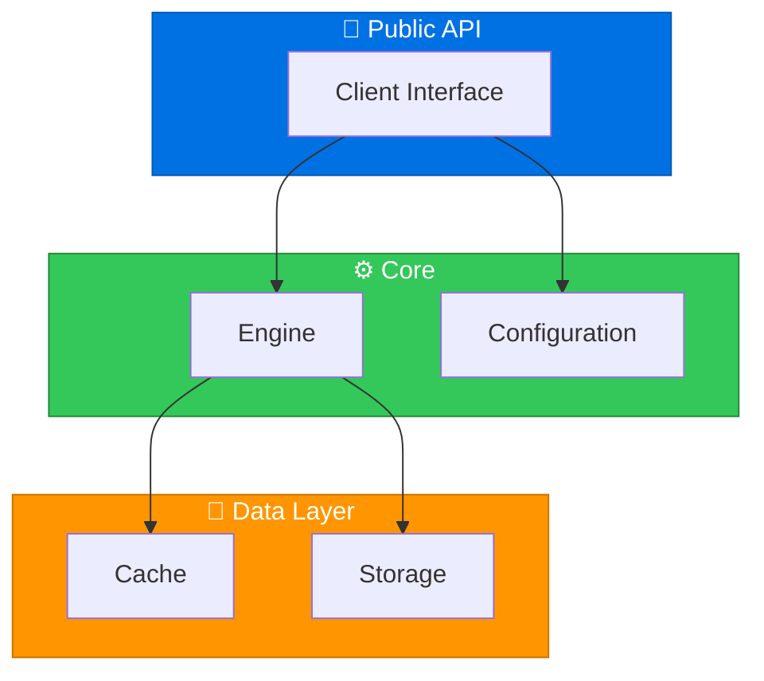

<p align="center">

<p align="center">
  <a href="README.md">🇺🇸 English</a> |
  <a href="README_TR.md">🇹🇷 Türkçe</a>
</p>

<pre>
╔═══════════════════════════════════════════════════════════════════════════════════════════════════╗
║                                                                                                   ║
║   ███████╗██╗    ██╗██╗███████╗████████╗██╗   ██╗██╗    ██████╗  █████╗ ████████╗ █████╗          ║
║   ██╔════╝██║    ██║██║██╔════╝╚══██╔══╝██║   ██║██║    ██╔══██╗██╔══██╗╚══██╔══╝██╔══██╗         ║
║   ███████╗██║ █╗ ██║██║█████╗     ██║   ██║   ██║██║    ██║  ██║███████║   ██║   ███████║         ║
║   ╚════██║██║███╗██║██║██╔══╝     ██║   ██║   ██║██║    ██║  ██║██╔══██║   ██║   ██╔══██║         ║
║   ███████║╚███╔███╔╝██║██║        ██║   ╚██████╔╝██║    ██████╔╝██║  ██║   ██║   ██║  ██║         ║
║   ╚══════╝ ╚══╝╚══╝ ╚═╝╚═╝        ╚═╝    ╚═════╝ ╚═╝    ╚═════╝ ╚═╝  ╚═╝   ╚═╝   ╚═╝  ╚═╝         ║
║                                                                                                   ║
║   ██╗   ██╗██╗███████╗██╗   ██╗ █████╗ ██╗     ██╗███████╗ █████╗ ████████╗██╗ ██████╗ ███╗   ██╗ ║
║   ██║   ██║██║██╔════╝██║   ██║██╔══██╗██║     ██║╚══███╔╝██╔══██╗╚══██╔══╝██║██╔═══██╗████╗  ██║ ║
║   ██║   ██║██║███████╗██║   ██║███████║██║     ██║  ███╔╝ ███████║   ██║   ██║██║   ██║██╔██╗ ██║ ║
║   ╚██╗ ██╔╝██║╚════██║██║   ██║██╔══██║██║     ██║ ███╔╝  ██╔══██║   ██║   ██║██║   ██║██║╚██╗██║ ║
║    ╚████╔╝ ██║███████║╚██████╔╝██║  ██║███████╗██║███████╗██║  ██║   ██║   ██║╚██████╔╝██║ ╚████║ ║
║     ╚═══╝  ╚═╝╚══════╝ ╚═════╝ ╚═╝  ╚═╝╚══════╝╚═╝╚══════╝╚═╝  ╚═╝   ╚═╝   ╚═╝ ╚═════╝ ╚═╝  ╚═══╝ ║
║                                                                                                   ║
║                    Beautiful • Interactive • Native SwiftUI Charts                                ║
╚═══════════════════════════════════════════════════════════════════════════════════════════════════╝
</pre>
</p>

<p align="center">
  <a href="https://swift.org"></a>
  <a href="https://developer.apple.com/ios/"></a>
  <a href="https://developer.apple.com/macos/"></a>
  <a href="LICENSE"></a>
</p>

<p align="center">
  <a href="https://github.com/muhittincamdali/SwiftUI-Data-Visualization/actions"></a>
  <a href="https://github.com/muhittincamdali/SwiftUI-Data-Visualization/releases"></a>
  <a href="https://github.com/muhittincamdali/SwiftUI-Data-Visualization/stargazers"></a>
  <a href="https://swift.org/package-manager/"></a>
</p>

<p align="center">
  <strong>A powerful, native SwiftUI charting library with 8 chart types, smooth animations, and complete customization.</strong>
</p>

---

## 📊 Chart Gallery

```
┌─────────────────────────────────────────────────────────────────────────────────┐
│                                                                                 │
│   LINE CHART                    BAR CHART                   PIE CHART           │
│                                                                                 │
│      ╭──╮                      ┌───┐                         ╭────╮            │
│     ╱    ╲    ╭──╮            ┌┤   │ ┌───┐             ╭────╮│████│╭────╮      │
│    ╱      ╲──╱    ╲          ┌┤│   │ │   │ ┌───┐      │░░░░││████││▒▒▒▒│      │
│   ╱                ╲        ┌┤││   │ │   │ │   │      │░░░░│╰────╯│▒▒▒▒│      │
│  ╱                  ╲      ┌┤│││   │ │   │ │   │       ╰────╮    ╭────╯       │
│                           └┴┴┴┴───┴─┴───┴─┴───┘              ╰──╯             │
│   └───────────────┘        Q1  Q2  Q3  Q4        35% Mobile  45% Web  20% API │
│                                                                                 │
├─────────────────────────────────────────────────────────────────────────────────┤
│                                                                                 │
│   AREA CHART                  SCATTER PLOT                RADAR CHART           │
│                                                                                 │
│      ╭──╮                        •                            ╱╲               │
│     ╱████╲    ╭──╮              •  •                        ╱    ╲             │
│    ╱██████╲──╱████╲           •    •  •                   ╱──────╲            │
│   ╱████████████████╲            •  •                      ╲      ╱            │
│  ╱██████████████████╲         •      •                      ╲──╱              │
│  ███████████████████████      •  •  •    •                    ╲╱               │
│                                                                                 │
├─────────────────────────────────────────────────────────────────────────────────┤
│                                                                                 │
│   CANDLESTICK CHART                        HEATMAP CHART                        │
│                                                                                 │
│      ┌─┐   ┌─┐                      ┌──┬──┬──┬──┬──┬──┬──┐                     │
│      │█│   │█│  │                   │██│▓▓│░░│▒▒│░░│▓▓│██│                     │
│    ──┼─┼───┼─┼──┼──                 ├──┼──┼──┼──┼──┼──┼──┤                     │
│      │█│   └─┘  │█│                 │▒▒│░░│▓▓│██│▓▓│░░│▒▒│                     │
│      └─┘        └─┘                 ├──┼──┼──┼──┼──┼──┼──┤                     │
│                                     │░░│▒▒│██│▓▓│██│▒▒│░░│                     │
│    Open-High-Low-Close              └──┴──┴──┴──┴──┴──┴──┘                     │
│                                                                                 │
└─────────────────────────────────────────────────────────────────────────────────┘
```

## ✨ Feature Matrix

| Feature | Line | Bar | Pie | Area | Scatter | Radar | Candlestick | Heatmap |
|:--------|:----:|:---:|:---:|:----:|:-------:|:-----:|:-----------:|:-------:|
| Smooth Animations | ✅ | ✅ | ✅ | ✅ | ✅ | ✅ | ✅ | ✅ |
| Touch Interaction | ✅ | ✅ | ✅ | ✅ | ✅ | ✅ | ✅ | ✅ |
| Zoom & Pan | ✅ | ✅ | ❌ | ✅ | ✅ | ❌ | ✅ | ✅ |
| Custom Colors | ✅ | ✅ | ✅ | ✅ | ✅ | ✅ | ✅ | ✅ |
| Gradients | ✅ | ✅ | ✅ | ✅ | ✅ | ❌ | ❌ | ✅ |
| Grid Lines | ✅ | ✅ | ❌ | ✅ | ✅ | ✅ | ✅ | ❌ |
| Axes Labels | ✅ | ✅ | ❌ | ✅ | ✅ | ✅ | ✅ | ✅ |
| Legend | ✅ | ✅ | ✅ | ✅ | ✅ | ✅ | ✅ | ✅ |
| Tooltips | ✅ | ✅ | ✅ | ✅ | ✅ | ✅ | ✅ | ✅ |
| Multi-Series | ✅ | ✅ | ❌ | ✅ | ✅ | ✅ | ❌ | ❌ |
| Real-Time Data | ✅ | ✅ | ✅ | ✅ | ✅ | ✅ | ✅ | ✅ |
| Accessibility | ✅ | ✅ | ✅ | ✅ | ✅ | ✅ | ✅ | ✅ |

## 🚀 Quick Start

### Installation

Add to your `Package.swift`:

```swift
dependencies: [
    .package(url: "https://github.com/muhittincamdali/SwiftUI-Data-Visualization.git", from: "1.0.0")
]
```

Or in Xcode: **File → Add Package Dependencies** → paste the URL.

### Basic Usage

```swift
import SwiftUIDataVisualization

// 1️⃣ Create data points
let salesData = [
    ChartDataPoint(label: "Jan", value: 4200),
    ChartDataPoint(label: "Feb", value: 5800),
    ChartDataPoint(label: "Mar", value: 4900),
    ChartDataPoint(label: "Apr", value: 7200),
    ChartDataPoint(label: "May", value: 8500),
    ChartDataPoint(label: "Jun", value: 9100)
]

// 2️⃣ Create the chart
LineChart(data: salesData)
    .chartStyle(.line)
    .animation(.easeInOut(duration: 0.5))
    .interactive(true)
    .frame(height: 300)
```

## 📈 Chart Examples

### Line Chart - Sales Trend

```swift
struct SalesTrendView: View {
    let monthlySales = [
        ChartDataPoint(label: "Jan", value: 12500),
        ChartDataPoint(label: "Feb", value: 18200),
        ChartDataPoint(label: "Mar", value: 15800),
        ChartDataPoint(label: "Apr", value: 22100),
        ChartDataPoint(label: "May", value: 28400),
        ChartDataPoint(label: "Jun", value: 31200)
    ]
    
    var body: some View {
        LineChart(data: monthlySales)
            .lineColor(.blue)
            .lineWidth(2.5)
            .showPoints(true)
            .pointStyle(.circle(radius: 5, fill: .white, stroke: .blue))
            .showGrid(true)
            .gridStyle(.dashed(color: .gray.opacity(0.3)))
            .xAxisLabel("Month")
            .yAxisLabel("Revenue ($)")
            .animated(true)
            .frame(height: 280)
    }
}
```

**Visual output:**
```
Revenue ($)
    │
32K ┤                           ╭────●
    │                     ╭────╯
28K ┤               ╭────╯
    │         ╭────╯
22K ┤   ╭────╯
    │   │
18K ┤   ●
    │ ╭╯
12K ┤ ●
    │
    └────┬─────┬─────┬─────┬─────┬────→ Month
        Jan   Feb   Mar   Apr   May   Jun
```

### Bar Chart - Quarterly Revenue

```swift
struct QuarterlyRevenueView: View {
    let quarterlyData = [
        ChartDataPoint(label: "Q1", value: 45000),
        ChartDataPoint(label: "Q2", value: 62000),
        ChartDataPoint(label: "Q3", value: 58000),
        ChartDataPoint(label: "Q4", value: 78000)
    ]
    
    var body: some View {
        BarChart(data: quarterlyData)
            .barColors([.blue, .green, .orange, .purple])
            .barCornerRadius(8)
            .showValues(true)
            .valueFormat("$%.0fK") { $0 / 1000 }
            .spacing(16)
            .animated(true)
            .animationStyle(.spring(response: 0.6, dampingFraction: 0.8))
            .frame(height: 300)
    }
}
```

**Visual output:**
```
         $78K
         ┌────┐
         │████│
         │████│
  $62K   │████│
  ┌────┐ │████│
  │████│ │████│
  │████│ │████│  $58K
$45K████│ │████│  ┌────┐
┌─│████│ │████│  │████│
│█│████│ │████│  │████│
│█│████│ │████│  │████│
└─┴────┴─┴────┴──┴────┴─
   Q1     Q2     Q3     Q4
```

### Pie Chart - Traffic Sources

```swift
struct TrafficSourcesView: View {
    let trafficData = [
        ChartDataPoint(label: "Organic", value: 45, color: .green),
        ChartDataPoint(label: "Direct", value: 25, color: .blue),
        ChartDataPoint(label: "Referral", value: 20, color: .orange),
        ChartDataPoint(label: "Social", value: 10, color: .purple)
    ]
    
    var body: some View {
        PieChart(data: trafficData)
            .innerRadius(0.5) // Creates donut chart
            .showPercentages(true)
            .showLabels(true)
            .labelPosition(.outside)
            .animated(true)
            .onSliceTap { slice in
                print("Tapped: \(slice.label) - \(slice.percentage)%")
            }
            .frame(width: 300, height: 300)
    }
}
```

**Visual output:**
```
                Organic 45%
                    ↓
              ╭─────────╮
           ╭──│█████████│──╮
         ╱ ███│█████████│███ ╲
        │█████│         │█████│ ← Direct 25%
        │█████│    ○    │░░░░░│
        │█████│         │░░░░░│
         ╲ ▒▒▒│░░░░░░░░░│▒▒▒ ╱
           ╰──│░░░░░░░░░│──╯
              ╰─────────╯
           ↑              ↑
     Social 10%      Referral 20%
```

### Area Chart - Website Visitors

```swift
struct VisitorsChartView: View {
    let visitorData = [
        ChartDataPoint(label: "Mon", value: 1200),
        ChartDataPoint(label: "Tue", value: 1850),
        ChartDataPoint(label: "Wed", value: 2100),
        ChartDataPoint(label: "Thu", value: 1750),
        ChartDataPoint(label: "Fri", value: 2400),
        ChartDataPoint(label: "Sat", value: 3100),
        ChartDataPoint(label: "Sun", value: 2800)
    ]
    
    var body: some View {
        AreaChart(data: visitorData)
            .fillGradient(
                Gradient(colors: [.blue.opacity(0.6), .blue.opacity(0.1)])
            )
            .lineColor(.blue)
            .lineWidth(2)
            .showPoints(true)
            .animated(true)
            .frame(height: 250)
    }
}
```

### Scatter Plot - Correlation Analysis

```swift
struct CorrelationChartView: View {
    let correlationData = (0..<50).map { _ in
        ChartDataPoint(
            x: Double.random(in: 0...100),
            y: Double.random(in: 0...100)
        )
    }
    
    var body: some View {
        ScatterChart(data: correlationData)
            .pointStyle(.circle(radius: 6, fill: .blue.opacity(0.6)))
            .showTrendLine(true)
            .trendLineColor(.red)
            .interactive(true)
            .zoomEnabled(true)
            .panEnabled(true)
            .frame(height: 300)
    }
}
```

### Candlestick Chart - Stock Data

```swift
struct StockChartView: View {
    let stockData = [
        CandlestickDataPoint(date: "Mon", open: 150, high: 158, low: 148, close: 155),
        CandlestickDataPoint(date: "Tue", open: 155, high: 162, low: 153, close: 160),
        CandlestickDataPoint(date: "Wed", open: 160, high: 165, low: 155, close: 157),
        CandlestickDataPoint(date: "Thu", open: 157, high: 163, low: 152, close: 161),
        CandlestickDataPoint(date: "Fri", open: 161, high: 168, low: 159, close: 166)
    ]
    
    var body: some View {
        CandlestickChart(data: stockData)
            .bullishColor(.green)
            .bearishColor(.red)
            .wickWidth(1)
            .candleWidth(12)
            .showVolume(true)
            .frame(height: 350)
    }
}
```

**Visual output:**
```
Price
  │
168├         │
166├         ┌┴┐
164├     │   │█│
162├   ┌─┤   │█│
160├   │█│ │ └┬┘
158├ │ │█│ ├─┤
156├ ├─┤ │ │█│
154├ │█│   │█│
152├ └┬┘   │ │
150├ ─┴────┴─┴────→
    Mon Tue Wed Thu Fri
    
█ = Bullish (Close > Open)
░ = Bearish (Close < Open)
```

### Heatmap Chart - Activity Matrix

```swift
struct ActivityHeatmapView: View {
    let activityData: [[Double]] = [
        [0.2, 0.5, 0.8, 0.3, 0.9, 0.4, 0.1],
        [0.6, 0.3, 0.7, 0.9, 0.5, 0.2, 0.4],
        [0.9, 0.8, 0.4, 0.6, 0.3, 0.7, 0.5],
        [0.3, 0.6, 0.9, 0.4, 0.8, 0.5, 0.2]
    ]
    
    var body: some View {
        HeatmapChart(
            data: activityData,
            colorScale: .viridis,
            rowLabels: ["Week 1", "Week 2", "Week 3", "Week 4"],
            columnLabels: ["Mon", "Tue", "Wed", "Thu", "Fri", "Sat", "Sun"]
        )
        .cellCornerRadius(4)
        .showValues(false)
        .animated(true)
        .frame(height: 200)
    }
}
```

## 🎨 Customization

### Color Scales (Heatmap)

```swift
// Built-in color scales
.colorScale(.viridis)    // Purple → Green → Yellow
.colorScale(.plasma)     // Purple → Pink → Yellow
.colorScale(.inferno)    // Black → Red → Yellow
.colorScale(.magma)      // Black → Purple → White
.colorScale(.coolwarm)   // Blue → White → Red

// Custom color scale
.colorScale(.custom([.blue, .white, .red]))
```

### Chart Themes

```swift
// Apply a theme
LineChart(data: data)
    .theme(.dark)      // Dark background
    .theme(.light)     // Light background
    .theme(.minimal)   // Clean, minimal style
    .theme(.vibrant)   // Bold colors

// Custom theme
let myTheme = ChartTheme(
    backgroundColor: .black,
    foregroundColor: .white,
    accentColor: .cyan,
    gridColor: .gray.opacity(0.3),
    fontFamily: .system(.body, design: .monospaced)
)

LineChart(data: data)
    .theme(myTheme)
```

### Animations

```swift
// Animation styles
.animationStyle(.easeIn)
.animationStyle(.easeOut)
.animationStyle(.spring(response: 0.5, dampingFraction: 0.7))
.animationStyle(.custom(Animation.interpolatingSpring(stiffness: 100, damping: 10)))

// Animation duration
.animationDuration(0.8)

// Staggered animations (for bar/pie charts)
.staggeredAnimation(delay: 0.1)
```

### Interactions

```swift
LineChart(data: data)
    // Enable interactions
    .interactive(true)
    .zoomEnabled(true)
    .panEnabled(true)
    .selectable(true)
    
    // Callbacks
    .onPointSelect { point in
        print("Selected: \(point.label) = \(point.value)")
    }
    .onZoomChange { scale in
        print("Zoom level: \(scale)")
    }
    
    // Custom tooltip
    .tooltip { point in
        VStack {
            Text(point.label).font(.headline)
            Text("$\(point.value, specifier: "%.2f")").font(.caption)
        }
        .padding(8)
        .background(.ultraThinMaterial)
        .cornerRadius(8)
    }
```

## 🏗️ Architecture

```
SwiftUI-Data-Visualization/
│
├── Sources/SwiftUIDataVisualization/
│   ├── Charts/
│   │   ├── LineChart.swift         # Line chart implementation
│   │   ├── BarChart.swift          # Bar chart implementation
│   │   ├── PieChart.swift          # Pie/Donut chart
│   │   ├── AreaChart.swift         # Area chart
│   │   ├── ScatterChart.swift      # Scatter plot
│   │   ├── RadarChart.swift        # Radar/Spider chart
│   │   ├── CandlestickChart.swift  # Financial OHLC chart
│   │   └── HeatmapChart.swift      # Matrix heatmap
│   │
│   ├── Models/
│   │   ├── ChartDataPoint.swift    # Data point models
│   │   └── ChartConfiguration.swift # Configuration options
│   │
│   ├── Styles/
│   │   ├── ChartStyle.swift        # Style definitions
│   │   ├── ChartTheme.swift        # Theme presets
│   │   └── ColorScales.swift       # Color scale definitions
│   │
│   ├── Modifiers/
│   │   ├── ChartModifiers.swift    # View modifiers
│   │   └── AnimationModifiers.swift # Animation helpers
│   │
│   └── Utils/
│       ├── MathUtils.swift         # Mathematical calculations
│       ├── GeometryUtils.swift     # Geometry helpers
│       └── AccessibilityUtils.swift # Accessibility support
│
├── Examples/
│   ├── BasicCharts/                # Basic usage examples
│   ├── AdvancedCharts/             # Advanced features
│   ├── RealTimeData/               # Live data examples
│   └── CustomStyling/              # Styling examples
│
├── Tests/
│   ├── SwiftUIDataVisualizationTests/
│   ├── SwiftUIDataVisualizationPerformanceTests/
│   └── SwiftUIDataVisualizationUITests/
│
└── Documentation/
    ├── ChartTypes.md
    ├── Customization.md
    ├── RealTimeData.md
    └── Accessibility.md
```

## 📱 Platform Support

| Platform | Minimum Version | Status |
|:---------|:---------------:|:------:|
| iOS | 15.0+ | ✅ Full Support |
| macOS | 12.0+ | ✅ Full Support |
| tvOS | 15.0+ | ✅ Full Support |
| watchOS | 8.0+ | ✅ Full Support |
| visionOS | 1.0+ | 🔜 Coming Soon |

## ⚡ Performance

Built with performance in mind:

- **Lazy rendering** - Only visible elements are rendered
- **Efficient animations** - Uses Metal-backed rendering
- **Memory optimized** - Automatic cleanup of off-screen elements
- **Large datasets** - Handles 10,000+ data points smoothly

```
┌─────────────────────────────────────────────────────────────┐
│                   Performance Benchmarks                    │
├─────────────────────────────────────────────────────────────┤
│  Data Points     │  Render Time  │  Memory Usage  │  FPS   │
├──────────────────┼───────────────┼────────────────┼────────┤
│  100             │  < 5ms        │  ~2 MB         │  60    │
│  1,000           │  < 15ms       │  ~8 MB         │  60    │
│  10,000          │  < 50ms       │  ~25 MB        │  60    │
│  100,000         │  < 200ms      │  ~80 MB        │  55+   │
└─────────────────────────────────────────────────────────────┘
```

## 📚 Documentation

| Document | Description |
|:---------|:------------|
| [Chart Types Guide](Documentation/ChartTypes.md) | Detailed guide for each chart type |
| [Customization](Documentation/Customization.md) | Styling, themes, and appearance |
| [Real-Time Data](Documentation/RealTimeData.md) | Live data and streaming |
| [Accessibility](Documentation/Accessibility.md) | VoiceOver and accessibility features |
| [API Reference](Documentation/API.md) | Complete API documentation |

## 🤝 Contributing

Contributions are welcome! Please read [CONTRIBUTING.md](CONTRIBUTING.md) for guidelines.

```bash
# Clone the repo
git clone https://github.com/muhittincamdali/SwiftUI-Data-Visualization.git

# Open in Xcode
cd SwiftUI-Data-Visualization
open Package.swift

# Run tests
swift test
```


## 🏗️ Architecture



## 📄 License

MIT License - see [LICENSE](LICENSE) for details.

## 👨‍💻 Author

**Muhittin Camdali**

[](https://github.com/muhittincamdali)
[](https://github.com/muhittincamdali/SwiftUI-Data-Visualization/actions)
---

<p align="center">
  <sub>Built with ❤️ using SwiftUI</sub>
</p>

<p align="center">
  <sub>If you find this useful, consider giving it a ⭐</sub>
</p>
